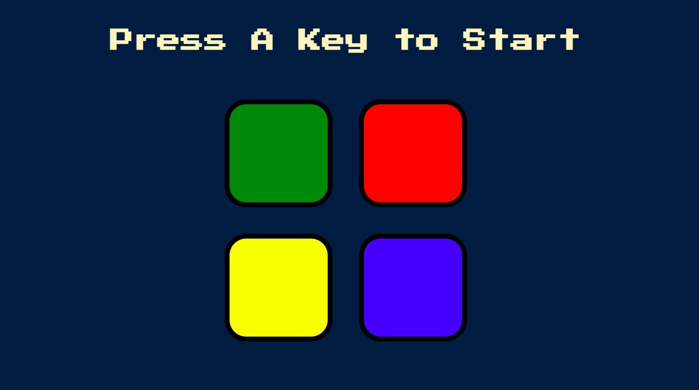
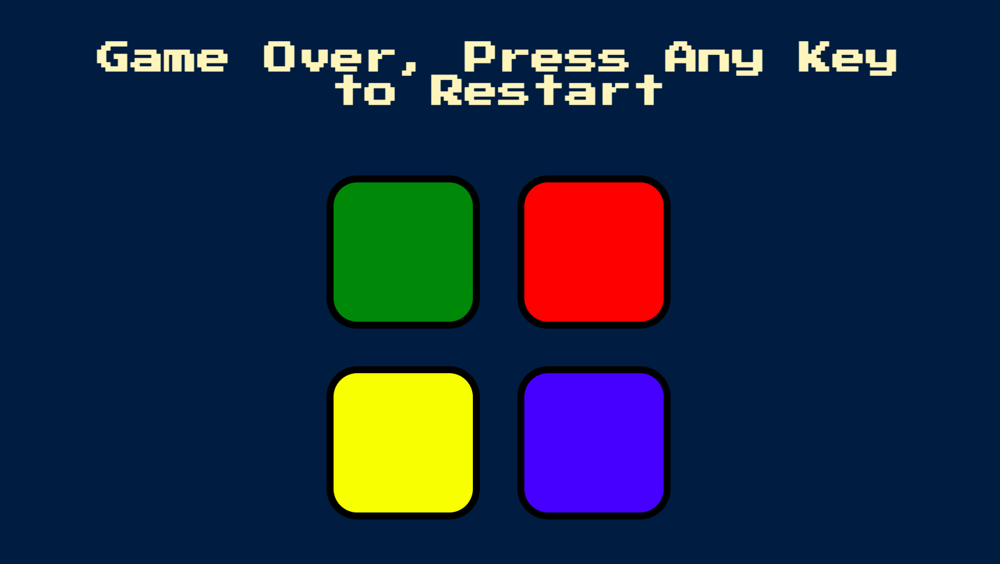

# The-Simon-Game

 ## Application description:

A Javascript  and jQuery application  that allows the user to play a guessing game called the Simon Game. The game consists of ramdomly choosing  a colored square that   blinks and makes a unique sound on the screen. For each square chosen correctly, the player has to memorize the previous chosen squares plus a new square that will be activiated in sucession.
 

 ## Click [here]( https://brianlevin.github.io/The-Simon-Game/) for the live app. 
 
 This is the start screen:
 
 
 
 
  This is the game over screen once the playe gets the answer wrong:
 
 
 
 This is a recorded example of the game:
 
## Click [here](https://drive.google.com/file/d/1u8cjI6JsV-HJWMvvDBXM2aOJ-hLqVg66/view?usp=sharing) to view video.
  
  

     
## Libraries and Frameworks:

- HTML
- CSS
- Javascript
- jQuery

## Email:

bml201095@gmail.com
